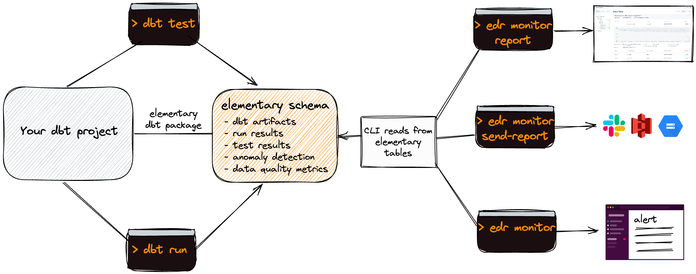

<h2 align="center">
 dbt native data observability for analytics & data engineers
</h2>
<h4 align="center">
Monitor your data quality, operation and performance directly from your dbt project.
</h4>

⭐️ Star the repo  ⭐

[Demo »](https://bit.ly/3IAp9wf) | [Docs »](https://docs.elementary-data.com/) | [Slack »](https://join.slack.com/t/elementary-community/shared_invite/zt-uehfrq2f-zXeVTtXrjYRbdE_V6xq4Rg)

## What is Elementary?

Elementary is an open-source data observability solution, built for dbt users. Setup in minutes, gain immediate visibility, detect data issues, send actionable alerts, and understand impact and root cause.

<kbd align="center">
        
</kbd>

 

## Quick start

Step 1 - [Install Elementary dbt package](https://docs.elementary-data.com/quickstart)

Step 2 - [Install Elementary CLI](https://docs.elementary-data.com/quickstart-cli)

## Features

 **Data observability report** - Generate a data observability report, host it or share with your team.

 **Anomaly detection dbt tests** - Collect data quality metrics and detect anomalies, as native dbt tests.

 **Test results** - Enriched with details for fast triage of issues.

 **Models performance** - Visibility of execution times, easy detection of degradation and bottlenecks.

 **Data lineage** - Enriched with test results, easy to navigate and filter.

 **dbt artifacts uploader** - Save metadata and run results as part of your dbt runs.

 **Slack alerts** - Actionable alerts, including custom channels and tagging of owners and subscribers.

##

Join [Slack](https://join.slack.com/t/elementary-community/shared_invite/zt-uehfrq2f-zXeVTtXrjYRbdE_V6xq4Rg) to learn more on Elementary.

Our full documentation is [available here](https://docs.elementary-data.com/).

## How it works?

Elementary [dbt package](https://github.com/elementary-data/dbt-data-reliability) creates tables of metadata and test results in your data warehouse, as part of your dbt runs. The CLI tool reads the data from these tables, and is used to generate the UI and alerts.

## Community & Support

For additional information and help, you can use one of these channels:

- [Slack](https://join.slack.com/t/elementary-community/shared_invite/zt-uehfrq2f-zXeVTtXrjYRbdE_V6xq4Rg) \(Live chat with the team, support, discussions, etc.\)
- [GitHub issues](https://github.com/elementary-data/elementary/issues) \(Bug reports, feature requests)
- [Twitter](https://twitter.com/ElementaryData) \(Updates on new releases and stuff)

## **Integrations**

- [x] **dbt core (>=1.0.0)** 
- [x] **dbt cloud** 

**Data warehouses:**

- [x] **Snowflake** 
- [x] **BigQuery** 
- [x] **Redshift** 
- [x] **Databricks SQL** 
- [x] **Postgres** 

**Operations:**

- [x] **Slack** 
- [x] **GitHub Actions** 
- [x] **Amazon S3** 
- [x] **Google Cloud Storage** 

Ask us for integrations on [Slack](https://join.slack.com/t/elementary-community/shared_invite/zt-uehfrq2f-zXeVTtXrjYRbdE_V6xq4Rg) or as a [GitHub issue](https://github.com/elementary-data/elementary-lineage/issues/new).

## **Contributions**

Thank you :orange_heart: Whether it’s a bug fix, new feature, or additional documentation - we greatly appreciate contributions!

Check out the [contributions guide](https://docs.elementary-data.com/general/contributions) and [open issues](https://github.com/elementary-data/elementary/issues).

**Elementary contributors: ✨**

[//]: contributor-faces

<!-- ALL-CONTRIBUTORS-LIST:START - Do not remove or modify this section -->
<!-- prettier-ignore-start -->
<!-- markdownlint-disable -->
 

<!-- markdownlint-restore -->
<!-- prettier-ignore-end -->

<!-- ALL-CONTRIBUTORS-LIST:END -->
