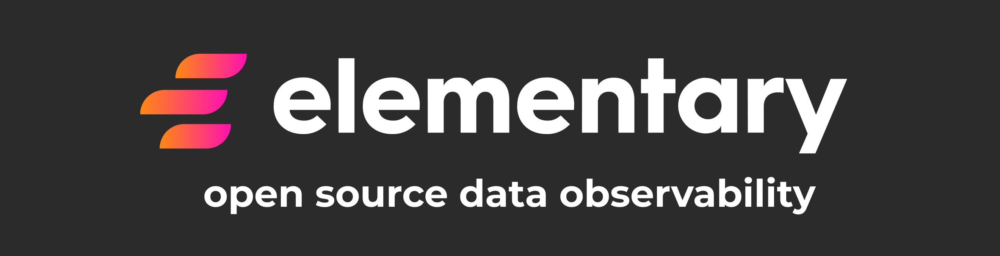

## Data Observability for Analytics Engineers

**Elementary is an open source data observability solution that is integrated with your dbt project.**

Add anomaly detections as dbt tests, and **monitor the results of both Elementary and dbt tests in a single report**. 

See tests results by model, and info for **fast triage**: sample failed rows, relevant queries, anomaly graph and test configuration.

Share the report with your team, and use Slack integration for alerting on incidents. 

##

:star: Support us with a  :star:  

### Checkout the [live demo](https://www.elementary-data.com/data-observability-demo)
 

## Quick start
  
[Quick start: Data monitoring as dbt tests in minutes](https://docs.elementary-data.com/quickstart). 

[Quick start: Data lineage](https://docs.elementary-data.com/quickstart-data-lineage/install-and-configure). 

Our full documentation is [available here](https://docs.elementary-data.com/). 
  
##

  
Join our [Slack](https://join.slack.com/t/elementary-community/shared_invite/zt-uehfrq2f-zXeVTtXrjYRbdE_V6xq4Rg) to learn more on Elementary.

  
## Elementary Features

* **Data anomalies monitoring as dbt tests**

    Elementary dbt tests are data monitors that collect metrics and metadata over time. 
    Elementary data monitors as tests are configured and executed like native tests in your project!

* **Data observability UI**
* **dbt artifacts uploader**
* **Slack alerts**
* **Data lineage made simple, reliable, and automated**

  
## Demo & Sandbox

Data anomalies monitoring as dbt tests [sandbox](https://www.elementary-data.com/data-observability-demo) and [demo video](https://www.elementary-data.com/demo).  
Try out our live lineage [sandbox here](https://www.elementary-data.com/live-demo).

## Community & Support

For additional information and help, you can use one of these channels:

* [Slack](https://join.slack.com/t/elementary-community/shared_invite/zt-uehfrq2f-zXeVTtXrjYRbdE_V6xq4Rg) \(Live chat with the team, support, discussions, etc.\)
* [GitHub issues](https://github.com/elementary-data/elementary-lineage/issues) \(Bug reports, feature requests)
* [Roadmap](https://github.com/elementary-data/elementary-lineage/projects/1) \(Vote for features and add your inputs)
* [Twitter](https://twitter.com/ElementaryData) \(Updates on new releases and stuff)

## **Integrations**

* [x] **Snowflake**  
* [x] **BigQuery**   
* [x] **Redshift**   - Data monitoring

Ask us for integrations on [Slack](https://join.slack.com/t/elementary-community/shared_invite/zt-uehfrq2f-zXeVTtXrjYRbdE_V6xq4Rg) or as a [GitHub issue](https://github.com/elementary-data/elementary-lineage/issues/new).

## **Contributions**

## **License**

Elementary is licensed under Apache License 2.0. See the [LICENSE](https://github.com/elementary-data/elementary-lineage/blob/master/LICENSE) file for licensing information.
