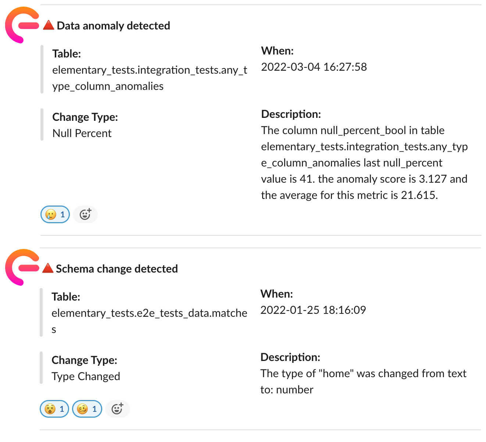

<p align="center">

</p>

<p align="center">
<a href="https://join.slack.com/t/elementary-community/shared_invite/zt-uehfrq2f-zXeVTtXrjYRbdE_V6xq4Rg"></a>


</p>

Monitor your data warehouse in minutes, and **be the first to know of data issues**. Gain immediate **visibility**, **monitor** your data and operation, **detect** data issues, and understand the **impact and root cause**. 

* **Data monitoring** - Set up monitoring for your warehouse in minutes, collect data quality metrics and detect data issues before your users do. 

* **Data lineage made simple, reliable, and automated** - Tracing the actual upstream & downstream dependencies in the data warehouse.

* **Operational monitoring** - Collect dbt artifacts, run and test results as part of your runs. Monitor the operations of your data stack, and centralize metadata easily. 

* **Slack alerts** - Get notifications on data issues, schema changes, jobs and tests failures. 


## 

Join our [Slack](https://join.slack.com/t/elementary-community/shared_invite/zt-uehfrq2f-zXeVTtXrjYRbdE_V6xq4Rg) to learn more on Elementary.

:star: If you like what we are building, support us with a <a href="https://github.com/elementary-data/elementary-lineage/stargazers"></a> :star:

##

## Demo & sandbox
Try out our live lineage [sandbox here](https://www.elementary-data.com/live-demo).

Data monitoring - Demo coming soon.




## Documentation

How to start? [Quickstart](https://docs.elementary-data.com/quickstart).</br>

Questions about the configuration? [Configuration FAQ here](https://docs.elementary-data.com/guides/connection-profile).</br>

Curious to learn about the different modules? [Modules overview](https://docs.elementary-data.com/guides/modules-overview).</br>


Our full documentation is [available here](https://docs.elementary-data.com/). 


## Quick start

**Install & connect**

```bash
pip install elementary-data

edr --help
```

Add your data warehouse connection details in a `profiles.yml` file, see our [quickstart page](https://docs.elementary-data.com/quickstart) to learn more or use [this template here](static/profiles.yml). Yes, if you are a dbt user we use dbt's profiles.yml by default (simply add a new profile called 'elementary').


**Data monitoring**

Add our dbt package to your project, and configure monitors. 
Execute it using:
```bash
edr monitor
```

To learn how to continuously monitor your data and get Slack notifications refer [data monitoring documentation](https://docs.elementary-data.com/guides/data-monitoring). 


**Data lineage**

```bash

# Generate data lineage graph
edr lineage 

# Filter the graph for a specific table, direction and depth
edr lineage -t +my_table+3

```
To learn more refer [data lineage documentation](https://docs.elementary-data.com/guides/data-lineage).


## Community & Support

For additional information and help, you can use one of these channels:

* [Slack](https://join.slack.com/t/elementary-community/shared_invite/zt-uehfrq2f-zXeVTtXrjYRbdE_V6xq4Rg) \(Live chat with the team, support, discussions, etc.\)
* [GitHub issues](https://github.com/elementary-data/elementary-lineage/issues) \(Bug reports, feature requests)
* [Roadmap](https://github.com/elementary-data/elementary-lineage/projects/1) \(Vote for features and add your inputs)
* [Twitter](https://twitter.com/ElementaryData) \(Updates on new releases and stuff)

## **Integrations**

* [x] **Snowflake**  - Lineage & monitoring
* [x] **BigQuery**   - Lineage only
* [ ] **Redshift**   

Ask us for integrations on [Slack](https://join.slack.com/t/elementary-community/shared_invite/zt-uehfrq2f-zXeVTtXrjYRbdE_V6xq4Rg) or as a [GitHub issue](https://github.com/elementary-data/elementary-lineage/issues/new).

## **License**

Elementary is licensed under Apache License 2.0. See the [LICENSE](https://github.com/elementary-data/elementary-lineage/blob/master/LICENSE) file for licensing information.
