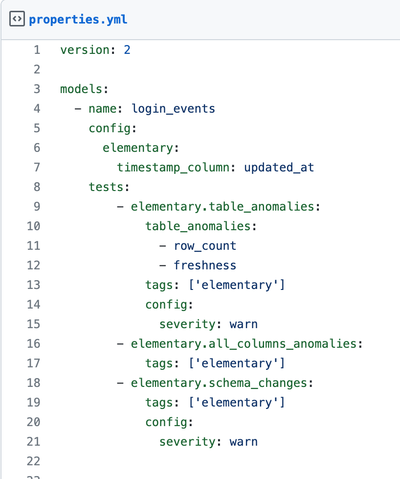

## Use cases
Monitor your data warehouse in minutes:
* **Data anomalies monitoring as dbt tests**
* **Data lineage made simple, reliable, and automated**
* **dbt operational monitoring**
* **Slack alerts**
  
:star: Support us with a  :star:
 

## Quick start
  
[Quick start: Data monitoring as dbt tests in minutes](https://docs.elementary-data.com/quickstart). 

[Quick start: Data lineage](https://docs.elementary-data.com/quickstart-data-lineage/install-and-configure). 

Our full documentation is [available here](https://docs.elementary-data.com/). 

##
Join our [Slack](https://join.slack.com/t/elementary-community/shared_invite/zt-uehfrq2f-zXeVTtXrjYRbdE_V6xq4Rg) to learn more on Elementary.

(Not a dbt user? you can still use Elementary data monitoring, reach out to us on Slack and we will help).
  
  
## Data anomalies monitoring as dbt tests

Elementary delivers **data monitoring and anomaly detection as dbt tests.** 
  
Elementary dbt tests are data monitors that collect metrics and metadata over time. 
On each execution, the tests analyze the new data, compare it to historical metrics, and alert on anomalies and outliers. 
  
**Elementary data monitors as tests are configured and executed like native tests in your project!**

## Demo & sandbox

Data anomalies monitoring as dbt tests [demo video](https://www.elementary-data.com/demo).  
Try out our live lineage [sandbox here](https://www.elementary-data.com/live-demo).

       
  

## Community & Support

For additional information and help, you can use one of these channels:

* [Slack](https://join.slack.com/t/elementary-community/shared_invite/zt-uehfrq2f-zXeVTtXrjYRbdE_V6xq4Rg) \(Live chat with the team, support, discussions, etc.\)
* [GitHub issues](https://github.com/elementary-data/elementary-lineage/issues) \(Bug reports, feature requests)
* [Roadmap](https://github.com/elementary-data/elementary-lineage/projects/1) \(Vote for features and add your inputs)
* [Twitter](https://twitter.com/ElementaryData) \(Updates on new releases and stuff)

## **Integrations**

* [x] **Snowflake**  
* [x] **BigQuery**   
* [ ] **Redshift**   

Ask us for integrations on [Slack](https://join.slack.com/t/elementary-community/shared_invite/zt-uehfrq2f-zXeVTtXrjYRbdE_V6xq4Rg) or as a [GitHub issue](https://github.com/elementary-data/elementary-lineage/issues/new).

## **License**

Elementary is licensed under Apache License 2.0. See the [LICENSE](https://github.com/elementary-data/elementary-lineage/blob/master/LICENSE) file for licensing information.
