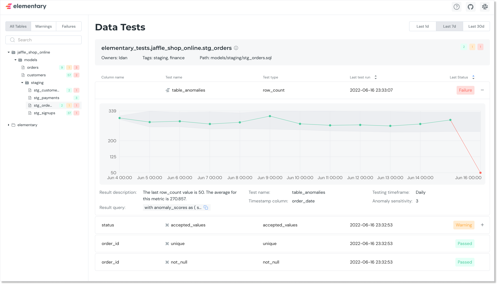

Open Source Data Observability for Analytics Engineers

**Monitor your dbt tests results** and add **Elementary anomaly detection tests** to your dbt project. 

See the test results on top of your dbt models in a report, with info for **fast triage**: test status, sample of failed rows, test queries, test configuration and anomaly detection metrics and graph.

Share the report with your team, and use Slack integration for alerting on incidents. 

##

:star: Support us with a  :star:  

### Checkout the [live demo](https://bit.ly/3ImsKxS)
 

## Quick start
  
Install dbt package & CLI -> Configure tests in dbt -> Alerts on Slack and detailed report  
[Quick start: Data monitoring as dbt tests in minutes](https://bit.ly/3IdMjYW). 

[Quick start: Data lineage](https://docs.elementary-data.com/quickstart-data-lineage/install-and-configure). 

Our full documentation is [available here](https://docs.elementary-data.com/). 
  
  
## Elementary Features

   **Data anomalies monitoring as dbt tests** - Collect metrics and metadata over time, detect anomalies, as native dbt tests in your project!

  **Data observability report** - Generate a report for all dbt tests and share with your team. 

  **dbt artifacts uploader**

  **Slack alerts**

  **Data lineage made simple, reliable, and automated**

##

  
Join [Slack](https://join.slack.com/t/elementary-community/shared_invite/zt-uehfrq2f-zXeVTtXrjYRbdE_V6xq4Rg) to learn more on Elementary.

  
## Demo & Sandbox

Data observability report [sandbox](https://bit.ly/3AtmH8Q) and [demo video](https://www.elementary-data.com/demo).  

Slack alert example:

## Community & Support

For additional information and help, you can use one of these channels:

* [Slack](https://join.slack.com/t/elementary-community/shared_invite/zt-uehfrq2f-zXeVTtXrjYRbdE_V6xq4Rg) \(Live chat with the team, support, discussions, etc.\)
* [GitHub issues](https://github.com/elementary-data/elementary/issues) \(Bug reports, feature requests)
* [Twitter](https://twitter.com/ElementaryData) \(Updates on new releases and stuff)

## **Integrations**

* [x] **Snowflake**  
* [x] **BigQuery**   
* [x] **Redshift**  

Ask us for integrations on [Slack](https://join.slack.com/t/elementary-community/shared_invite/zt-uehfrq2f-zXeVTtXrjYRbdE_V6xq4Rg) or as a [GitHub issue](https://github.com/elementary-data/elementary-lineage/issues/new).

## **Contributions**

Thank you :orange_heart: Whether it’s a bug fix, new feature, or additional documentation - we greatly appreciate contributions!

Check out the [contributions guide](https://docs.elementary-data.com/project-overview/contributions). 

## **License**

Elementary is licensed under Apache License 2.0. See the [LICENSE](https://github.com/elementary-data/elementary-lineage/blob/master/LICENSE) file for licensing information.
