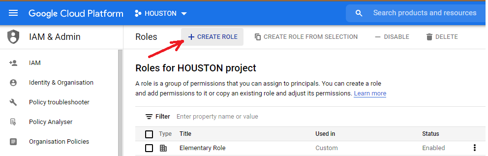
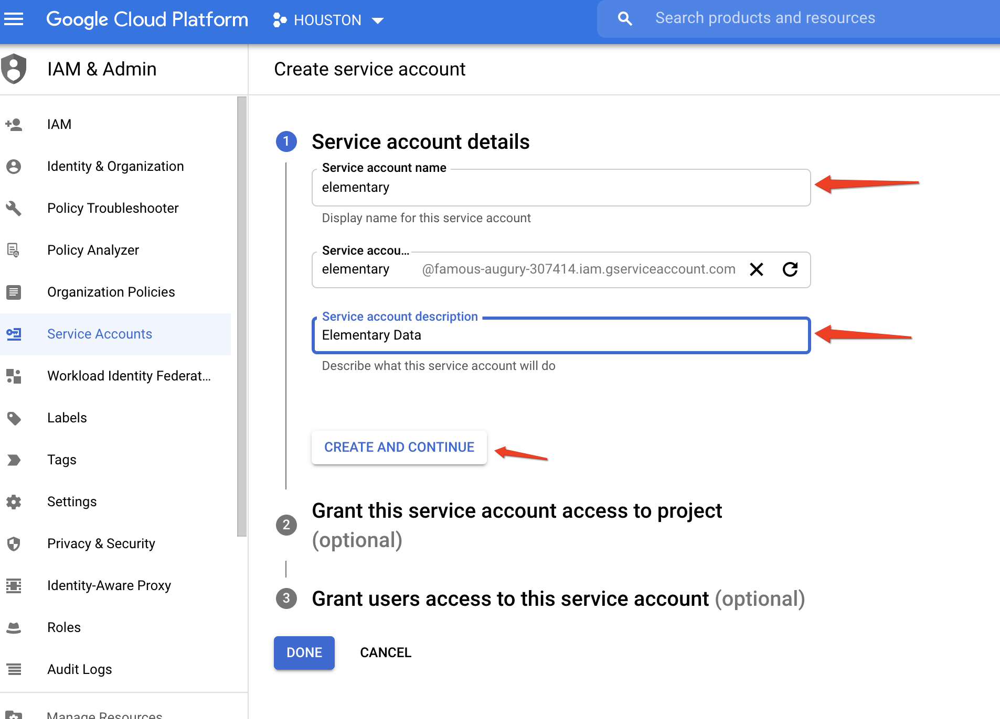
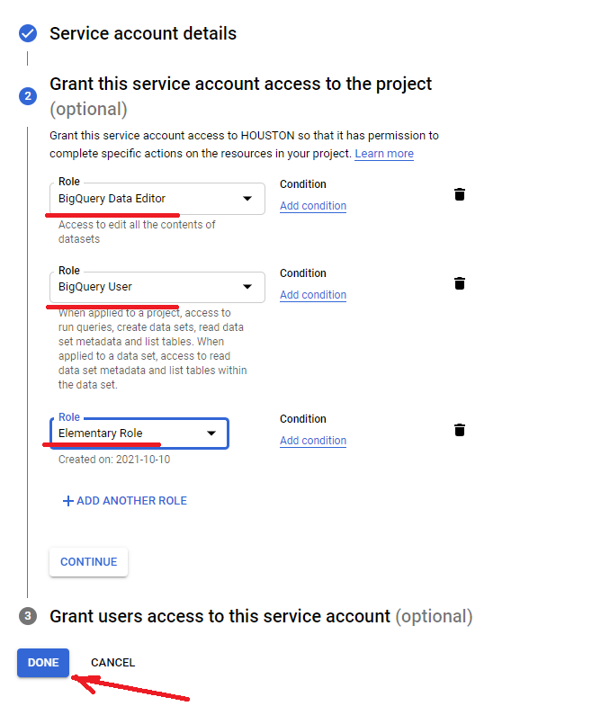
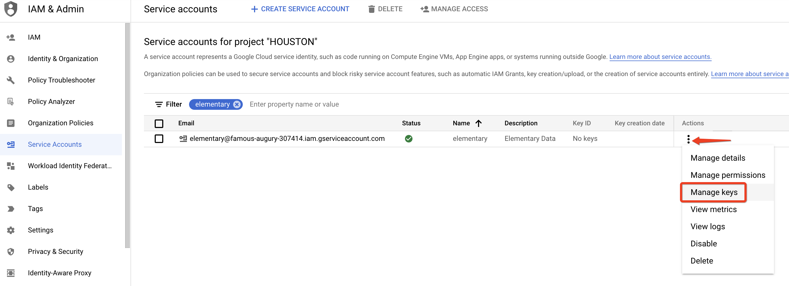
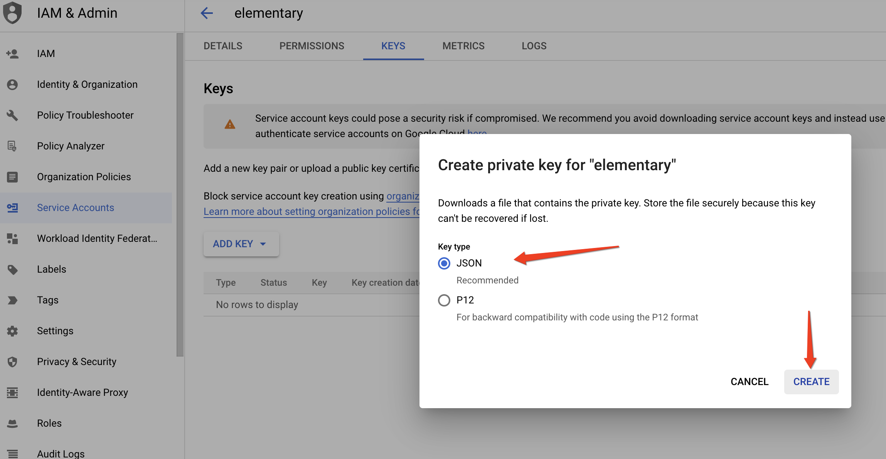

import { TipInfo } from '@/components/Tip'

## Data anomalies monitoring as dbt tests

Supports Bigquery since version 0.3.4

---

## Lineage

### BigQuery query source

The query history in BigQuery is pulled from the [information schema](https://cloud.google.com/bigquery/docs/information-schema-intro), by accessing a view that contains [jobs metadata](https://cloud.google.com/bigquery/docs/information-schema-jobs) by project. 

The retention of this view is **180 days**, meaning that queries older than that will not be part of the lineage. 

<TipInfo>Note that each query source requires different permissions. If these are not granted, Elementary will create partial lineage only based on accessible queries, or will return an error if there is no access at all.</TipInfo>

### BigQuery connection profile

The profiles.yml file to connect to BigQuery should contain a profile in the following format:

```yml BigQuery
## By default, edr expects the profile name 'elementary'.      ##
##                                                             ##
## For edr monitor:                                            ##
## The database and schema of edr models.                      ##
## Check where 'elementary_test_results' is to find it.        ##
##                                                             ##
## For edr lineage:                                            ##
## Any database and schema will do.                            ##


elementary: 
  outputs:
    default:  
      type: bigquery
      
      ## Service account auth, other options require other configs ##
      method: service-account
      keyfile: [full path to your keyfile]
      
      project: [project id]
      dataset: [dataset name]
      threads: 4
      ## Location is mandatory, can be one of US or EU, or a regional location
      location: [dataset location]
      priority: interactive
```

We support the same format and connection methods as dbt. Please refer to dbt's documentation of [BigQuery](https://docs.getdbt.com/reference/warehouse-profiles/bigquery-profile) for further details. 

Note that although in dbt the 'location' parameter is optional, in Elementary lineage it is mandatory. Here are details about [BigQuery locations](https://cloud.google.com/bigquery/docs/locations).

### Data lineage BigQuery permissions

The queries are pulled from the information schema view of [jobs by project](https://cloud.google.com/bigquery/docs/information-schema-jobs).

This requires `bigquery.jobs.listAll` permission for the project, that is available by default only to the `Project Owner` and BigQuery `Admin` roles. 

There are two options for creating an account with the required permissions:

1. Create an account and grant it Project Owner or BigQuery Admin role.
2. Recommended: create an account and grant it BigQuery Data Editor + BigQuery User + custom role that has bigquery.jobs.listAll permission.

Here is a [guide for creating a service account](https://docs.elementary-data.com/integrations/bigquery/create-bigquery-service-account) for both options.

## Create BigQuery service account

For Elementary to be able to access the jobs by project in the information schema, there are two options:
1. Create service account with Project Owner or BigQuery Admin role. For this option, skip to create service account.
2. Recommended: Create service account with lower permissions by creating a custom role. For this option, you need to create the custom role first.

### Create custom role

1. In the Cloud Console, go to: IAM & Admin > [Roles](https://console.cloud.google.com/iam-admin/roles?pli=1)

2. Click on 'CREATE ROLE'



3. Give the role a title, description, etc. 

4. Click on '+ ADD PERMISSIONS'

5. Using the filter, find and add the permissions bigquery.jobs.listall and bigquery.jobs.create, then click 'ADD':


6. Click 'CREATE' and make sure the new role was created and is now in the roles list.

### Create service account:

1. In the Cloud Console, go to: IAM & Admin > Service Accounts

2. Click on 'CREATE SERVICE ACCOUNT'


3. Fill in the service account name ('elementary') and account description ('Elementary Data') and click 'CREATE AND CONTINUE':



4. Now we need to configure the relevant permissions for this new service account. As described, at this point there are two options -
  1. Option 1 - Choose BigQuery Admin or Owner.
  2. Recommended: Option 2 - Choose the following 3 roles: BigQuery Data Editor + BigQuery User + custom role you created with these instructions: 



5. The last step is optional so skip it if you don't need to manage this service account with another service account, and press done.

6. Press on the dots icon to the right of your screen for your new service account and select 'Manage keys':



7. Press on 'ADD KEY' and select 'Create new key':


8. Use the 'JSON' option radio button and press 'CREATE':



9. This will automatically generate and download a JSON file with your private key information for this service account. This JSON file provides the credentials to programmatically connect and work with your BigQuery environment.

10. Add the full path of this JSON file to your connection profile under 'keyfile'.

### Have a question?

We are available on [Slack](https://join.slack.com/t/elementary-community/shared_invite/zt-uehfrq2f-zXeVTtXrjYRbdE_V6xq4Rg), reach out for any kind of help!