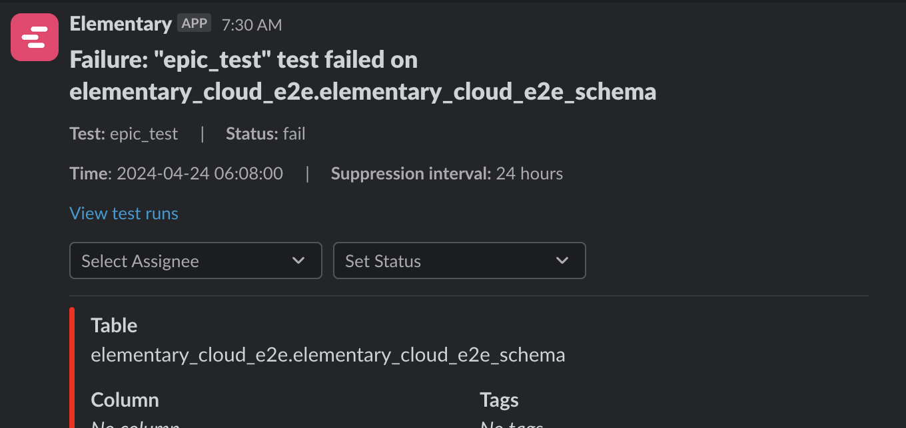
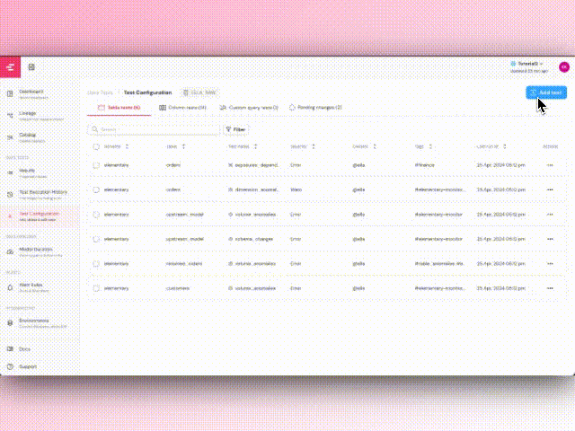
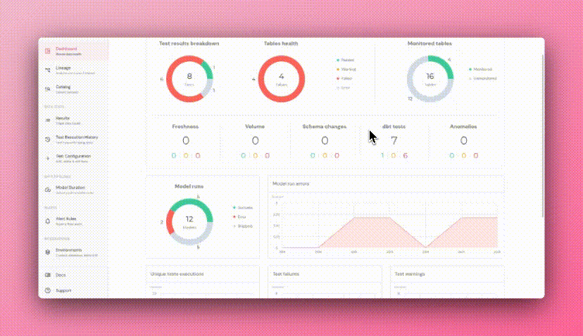
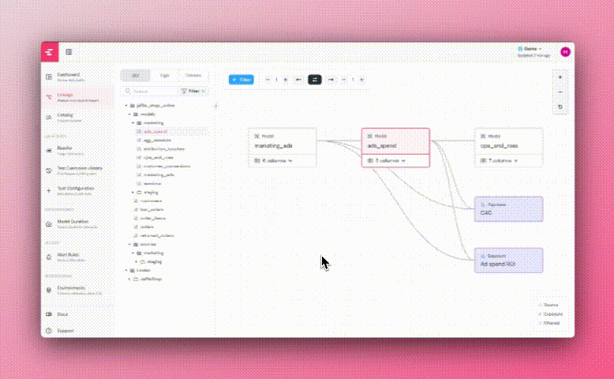
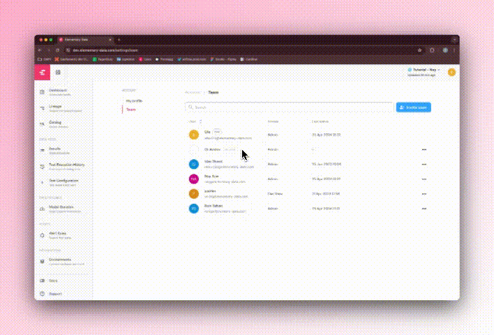

## May 2024

### Test configuration supports ANY dbt TEST OUT THERE! 😱

<div style={{ display: "table", width: "auto" }}>
    <div style={{ display: "table-row", width: "auto" }}>
        <div style={{ float: "left", display: "table-column", width: "100%", marginBottom: "20px" }}>
            <span
                style={{ 
                background: "#FECDD8",
                color: "#BD134F",
                borderRadius: "8px",
                fontSize: ".8em",
                padding: "2px 10px",
                display: "inline-block",
                fontWeight: "500",
                letterSpacing: ".5px",
                whiteSpace: "nowrap",
                }}
            >Test configuration</span>
        </div>
        <div
            style={{
            float: "left",
            display: "table-column",
            paddingLeft: "0px",
            width: "100%",
            marginTop: "-20px",
            }}
        >
        Our new YAML editor allows you to add ANY dbt test that exists in the dbt ecosystem, in bulk and directly from the UI!

        It supports any dbt expectation or utils test out of the box, and you can use it to add your own custom generic tests to tables and columns.

        <video
        autoPlay
        muted
        loop
        playsInline
        className="w-full aspect-video"
        src="https://res.cloudinary.com/diuctyblm/video/upload/v1719320339/Changelog/YAML_for_all_tests_x0k48v.mp4"
        ></video>

        </div>
    </div>

</div>

### Detection of column anomalies by dimensions

<div style={{ display: "table", width: "auto" }}>
    <div style={{ display: "table-row", width: "auto" }}>
        <div style={{ float: "left", display: "table-column", width: "100%", marginBottom: "20px" }}>
            <span
                style={{ 
                background: "#FECDD8",
                color: "#BD134F",
                borderRadius: "8px",
                fontSize: ".8em",
                padding: "2px 10px",
                display: "inline-block",
                fontWeight: "500",
                letterSpacing: ".5px",
                whiteSpace: "nowrap",
                }}
            >Anomaly detection</span>
        </div>
        <div
            style={{
            float: "left",
            display: "table-column",
            paddingLeft: "0px",
            width: "100%",
            marginTop: "-20px",
            }}
        >
        You can now add a new parameter to your column anomaly tests -  `dimensions`.

        This will calculate the column metrics for every time bucket and table dimension values, allowing you to detect anomalies in specific segments of your data.

        For example, if you want to detect anomalies in a revenue column and you have multiple apps in different countries - now you can detect anomalies in revenue in a specific country.

        Here is an example of how this can be configured-

        ```yaml
        models:
        ....
            columns:
            - name: in_app_purchase_revenue
                tests:
                - elementary.column_anomalies:
                    column_anomalies:
                        - sum
                    dimensions:
                        - app_name
                        - country
        ```

        </div>
    </div>

</div>

### Column level lineage ENRICHED with TEST RESULTS

<div style={{ display: "table", width: "auto" }}>
    <div style={{ display: "table-row", width: "auto" }}>
        <div style={{ float: "left", display: "table-column", width: "100%", marginBottom: "20px" }}>
            <span
                style={{ 
                background: "#FECDD8",
                color: "#BD134F",
                borderRadius: "8px",
                fontSize: ".8em",
                padding: "2px 10px",
                display: "inline-block",
                fontWeight: "500",
                letterSpacing: ".5px",
                whiteSpace: "nowrap",
                }}
            >Lineage</span>
        </div>
        <div
            style={{
            float: "left",
            display: "table-column",
            paddingLeft: "0px",
            width: "100%",
            marginTop: "-20px",
            }}
        >
        We are excited to be the first (and only) tool in the industry that lets investigate test results right on top of your column level lineage graph. With this new release you can filter the lineage graph on a specific column that has an issue, and see if upstream or downstream columns or BI assets  have similar test failures to understand the root cause fast. 
        
        <video
        autoPlay
        muted
        loop
        playsInline
        className="w-full aspect-video"
        src="https://res.cloudinary.com/diuctyblm/video/upload/v1719320341/Changelog/Test_results_in_lineage_p6wy8y.mp4"
        ></video>

        </div>
    </div>

</div>

### Test Execution History is now showing test durations

<div style={{ display: "table", width: "auto" }}>
    <div style={{ display: "table-row", width: "auto" }}>
        <div style={{ float: "left", display: "table-column", width: "100%", marginBottom: "20px" }}>
            <span
                style={{ 
                background: "#FECDD8",
                color: "#BD134F",
                borderRadius: "8px",
                fontSize: ".8em",
                padding: "2px 10px",
                display: "inline-block",
                fontWeight: "500",
                letterSpacing: ".5px",
                whiteSpace: "nowrap",
                }}
            >Test execution history</span>
        </div>
        <div
            style={{
            float: "left",
            display: "table-column",
            paddingLeft: "0px",
            width: "100%",
            marginTop: "-20px",
            }}
        >
        We added test durations to the Test Execution History (the command and control center for your tests). You can now monitor your tests performance and see which tests are taking the longest or if there was any degradation in performance of specific tests.

        Easily sort your tests by execution duration and see which ones are taking the longest and choose the most promising candidates for optimization. This can also be used for cost analysis as slow tests tend to be more expensive.

        Check it out:

        <video
        autoPlay
        muted
        loop
        playsInline
        className="w-full aspect-video"
        src="https://res.cloudinary.com/diuctyblm/video/upload/v1719320330/Changelog/Test_duration_waxg1j.mp4"
        ></video>

        </div>
    </div>

</div>

### Sync now

<div style={{ display: "table", width: "auto" }}>
    <div style={{ display: "table-row", width: "auto" }}>
        <div style={{ float: "left", display: "table-column", width: "100%", marginBottom: "20px" }}>
            <span
                style={{ 
                background: "#FECDD8",
                color: "#BD134F",
                borderRadius: "8px",
                fontSize: ".8em",
                padding: "2px 10px",
                display: "inline-block",
                fontWeight: "500",
                letterSpacing: ".5px",
                whiteSpace: "nowrap",
                }}
            >Environments</span>
        </div>
        <div
            style={{
            float: "left",
            display: "table-column",
            paddingLeft: "0px",
            width: "100%",
            marginTop: "-20px",
            }}
        >
        We are excited to launch a new `Sync Now` button right in your environments page. You can think of is as a "refresh now" button for your environment.
        If you introduced a change in your environment and you want to see it in Elementary immediately - just click ‘sync now’.

        Here is what it looks like -

        <video
        autoPlay
        muted
        loop
        playsInline
        className="w-full aspect-video"
        src="https://res.cloudinary.com/diuctyblm/video/upload/v1719320332/Changelog/sync_now2_qbb6n3.mp4"
        ></video>

        </div>
    </div>

</div>

## April 2024


### Status and assignee for alerts 🔔

<div style={{ display: "table", width: "auto" }}>
    <div style={{ display: "table-row", width: "auto" }}>
        <div style={{ float: "left", display: "table-column", width: "100%", marginBottom: "20px" }}>
            <span
                style={{ 
                background: "#FECDD8",
                color: "#BD134F",
                borderRadius: "8px",
                fontSize: ".8em",
                padding: "2px 10px",
                display: "inline-block",
                fontWeight: "500",
                letterSpacing: ".5px",
                whiteSpace: "nowrap",
                }}
            >Alerts</span>
        </div>
        <div
            style={{
            float: "left",
            display: "table-column",
            paddingLeft: "0px",
            width: "100%",
            marginTop: "-20px",
            }}
        >
        An alert is just the start of a triage and response process. We have big plans for making this process much more effective. The first step was alert rules, and now we are introducing status and assignee selection in our alerts.
        
        This should help you manage incidents and collaborate more effectively with your team.
        
        *Note: at this time the status and assignee are not reflected in the Elementary UI, but this is expected to change in the near future ​:smile:*

        <Frame>
        
        </Frame>

    </div>

</div>
</div>

### Custom SQL tests in UI 🧪

<div style={{ display: "table", width: "auto" }}>
    <div style={{ display: "table-row", width: "auto" }}>
        <div style={{ float: "left", display: "table-column", width: "100%", marginBottom: "20px" }}>
            <span
                style={{ 
                background: "#FECDD8",
                color: "#BD134F",
                borderRadius: "8px",
                fontSize: ".8em",
                padding: "2px 10px",
                display: "inline-block",
                fontWeight: "500",
                letterSpacing: ".5px",
                whiteSpace: "nowrap",
                }}
            >Test configuration</span>
        </div>
        <div
            style={{
            float: "left",
            display: "table-column",
            paddingLeft: "0px",
            width: "100%",
            marginTop: "-20px",
            }}
        >
        Custom query testing is a must-have to validate business logic specific to your data team. You can now create custom SQL tests with Elementary, which will be translated into singular tests in your dbt project.

        <Frame>
        
        </Frame>

        </div>
    </div>

</div>

### Model runs in dashboard 📈

<div style={{ display: "table", width: "auto" }}>
    <div style={{ display: "table-row", width: "auto" }}>
        <div style={{ float: "left", display: "table-column", width: "100%", marginBottom: "20px" }}>
            <span
                style={{ 
                background: "#FECDD8",
                color: "#BD134F",
                borderRadius: "8px",
                fontSize: ".8em",
                padding: "2px 10px",
                display: "inline-block",
                fontWeight: "500",
                letterSpacing: ".5px",
                whiteSpace: "nowrap",
                }}
            >Dashboard</span>
        </div>
        <div
            style={{
            float: "left",
            display: "table-column",
            paddingLeft: "0px",
            width: "100%",
            marginTop: "-20px",
            }}
        >
        The results of your jobs are critical to the data health. These are now included in the Elementary dashboard, for you to get a complete overview of the status of your pipelines. We added a breakdown of the latest result of each model, and the aggregated failures over time.

        <Frame>
        
        </Frame>

        </div>
    </div>

</div>

### Lineage improvements - Load DAG subset ⬆️

<div style={{ display: "table", width: "auto" }}>
    <div style={{ display: "table-row", width: "auto" }}>
        <div style={{ float: "left", display: "table-column", width: "100%", marginBottom: "20px" }}>
            <span
                style={{ 
                background: "#FECDD8",
                color: "#BD134F",
                borderRadius: "8px",
                fontSize: ".8em",
                padding: "2px 10px",
                display: "inline-block",
                fontWeight: "500",
                letterSpacing: ".5px",
                whiteSpace: "nowrap",
                }}
            >Lineage</span>
        </div>
        <div
            style={{
            float: "left",
            display: "table-column",
            paddingLeft: "0px",
            width: "100%",
            marginTop: "-20px",
            }}
        >
        To improve UX and performance, we changed the default behavior in the lineage. When a node or group of nodes is chosen, only the first hop in both directions is loaded. To see the rest of the hops you can use the +/- buttons (see video).

        <Frame>
        
        </Frame>

        </div>
    </div>

</div>

### Role-based access control 🚦

<div style={{ display: "table", width: "auto" }}>
    <div style={{ display: "table-row", width: "auto" }}>
        <div style={{ float: "left", display: "table-column", width: "100%", marginBottom: "20px" }}>
            <span
                style={{ 
                background: "#FECDD8",
                color: "#BD134F",
                borderRadius: "8px",
                fontSize: ".8em",
                padding: "2px 10px",
                display: "inline-block",
                fontWeight: "500",
                letterSpacing: ".5px",
                whiteSpace: "nowrap",
                }}
            >Team</span>
        </div>
        <div
            style={{
            float: "left",
            display: "table-column",
            paddingLeft: "0px",
            width: "100%",
            marginTop: "-20px",
            }}
        >
        Elementary now allows creating users with different roles. This will allow you to add more users from your team to Elementary, allowing them to view results without giving them the ability to change environment settings.

        *Note: All the existing users now have "Admin" roles but this can be modified using the team management screen.*

        <Frame>
        
        </Frame>

        </div>
    </div>

</div>
