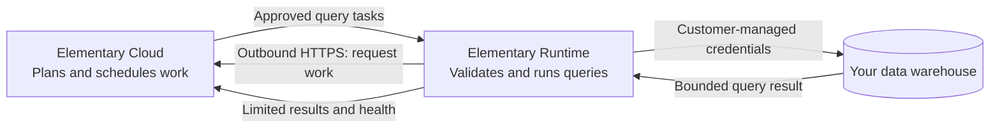

<Warning>
  **Private beta:** Elementary Runtime is available to selected design partners. Its capabilities and interface may change before general availability.
</Warning>

Elementary Runtime lets Elementary Cloud run supported data-quality queries inside your environment. You keep the warehouse credentials that can read your business data, while Elementary Cloud continues to manage tests, schedules, results, and incidents.

## How it works

Elementary Runtime is a small service that runs in your network. It uses an outbound HTTPS connection to request work from Elementary Cloud, validates each query locally, and runs approved queries with customer-managed warehouse credentials.

Elementary Cloud remains the control plane. It decides what should run, prepares the SQL, schedules tests, interprets results, and manages incidents. Elementary Runtime is the data plane for supported operations. It checks and executes the SQL, then returns only the result needed by the Cloud workflow.

## Why use Elementary Runtime

<CardGroup cols={2}>
  <Card title="Keep data access in your environment" icon="key">
    Credentials that can read your business tables stay with the runtime in your network.
  </Card>
  <Card title="Apply guardrails locally" icon="shield-check">
    The runtime checks SQL before execution and enforces local limits for time, concurrency, and result size.
  </Card>
  <Card title="Control what leaves your network" icon="filter">
    Queries return bounded results. Row samples can be limited or disabled for sensitive workloads.
  </Card>
  <Card title="Keep the managed Cloud experience" icon="cloud">
    Elementary Cloud continues to handle scheduling, test results, health visibility, incidents, and alerts.
  </Card>
</CardGroup>
