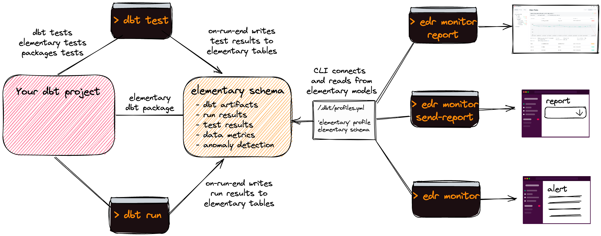

<Example>
  

    
  

</Example>

## What is Elementary?

Elementary is an open-source data observability solution for data & analytics engineers.

Monitor your dbt project and data in minutes, and be the first to know of data issues. Gain immediate
visibility, detect data issues, send actionable alerts, and understand the impact and root cause.

## Key features

- **Data observability report ([live demo](https://storage.googleapis.com/elementary_static/elementary_demo.html))** 
 
  Triage anomalies and dbt tests in a UI that visualizes results and provides all the information you need in a single place.

- **Data anomaly detection as dbt tests** 

  Monitoring of data quality metrics, freshness, volume and schema changes, including anomaly detection. Elementary data monitors are configured and executed like native tests in dbt your project!

- **dbt artifacts and run results** 
 
  Uploading and modeling of dbt artifacts, run and test results to tables as part of your runs.

- **Slack alerts** 

  Get informative notifications on data issues, schema changes, models and tests failures.

- **Data lineage** 

  Inspect upstream and downstream dependencies to understand impact and root cause of data issues.

## How it works?

For the data monitoring and dbt artifacts collection, we developed a [dbt package](./quickstart-data-monitoring#install-the-dbt-package).
The monitoring configuration is configured in your dbt project, and the monitors are dbt macros and models. All the collected data is saved to an elementary schema in your DWH.

[Elementary CLI](../learn/cli-install#install-and-configure) is used to generate the UI report and send Slack alerts.

## Community & Support

For additional information and help, you can use one of these channels:

- [Slack](https://join.slack.com/t/elementary-community/shared_invite/zt-uehfrq2f-zXeVTtXrjYRbdE_V6xq4Rg) (live chat with the team, feature requests, community support, discussions, etc.)
- [GitHub](https://github.com/elementary-data/elementary-lineage/issues) (bug reports, contributions)
- [Twitter](https://twitter.com/ElementaryData) (updates on new releases and stuff)
- [Email](mailto:team@elementary-data.com) us (about whatever)

## Integrations

- [x] dbt
- [x] Snowflake
- [x] BigQuery
- [x] Redshift
- [x] Slack

Ask us for integrations on [Slack](https://join.slack.com/t/elementary-community/shared_invite/zt-uehfrq2f-zXeVTtXrjYRbdE_V6xq4Rg) or as a [Github](https://github.com/elementary-data/elementary-lineage) issue.
