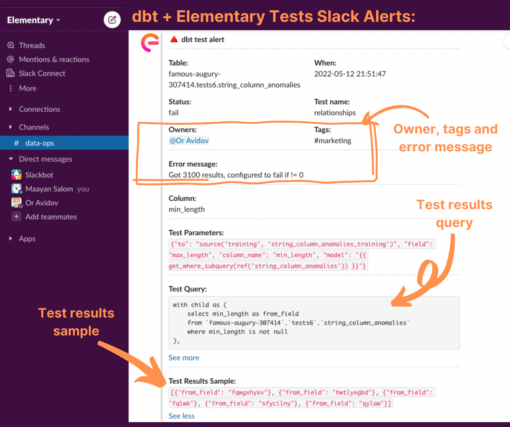

Elementary has a Slack integration to send alerts about failures in dbt tests or Elementary anomaly detection tests.

In order to send Slack alerts after you deploy the [dbt-package](../overview/contributions#guide-on-contributing-to-the-dbt-package) and configure tests, use the [CLI](/cli-install) and the [Slack](../integrations/slack) integration.

After installing and configuring the CLI, execute the command:

```
edr monitor
```

The command will use the provided connection profile to access the data warehouse, read from the Elementary tables, and send informative alerts to Slack.


