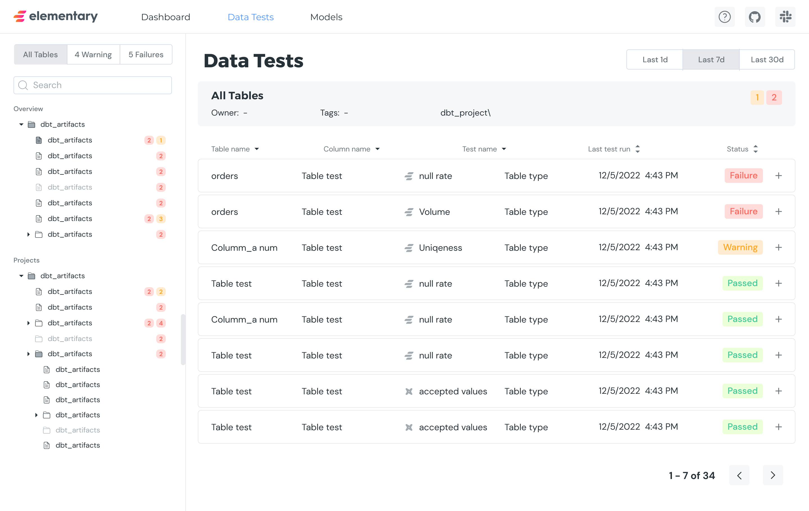

Elementary has a UI for visualization and exploration of data from the [dbt-package](../overview/contributions#guide-on-contributing-to-the-dbt-package) tables, which includes dbt test results, Elementary anomaly detection results, dbt artifacts, etc.

In order to visualize the data from the [dbt-package](../overview/contributions#guide-on-contributing-to-the-dbt-package) tables, use the [CLI](./cli-install) you can generate the Elementary UI.
After installing and configuring the CLI, execute the command:

```shell
edr monitor report
```




The command will use the provided connection profile to access the data warehouse, read from the Elementary tables, and generate the UI as an HTML file.

UI Screens:

- [Data tests report](../data-monitoring/data-and-dbt-tests-report-ui)
